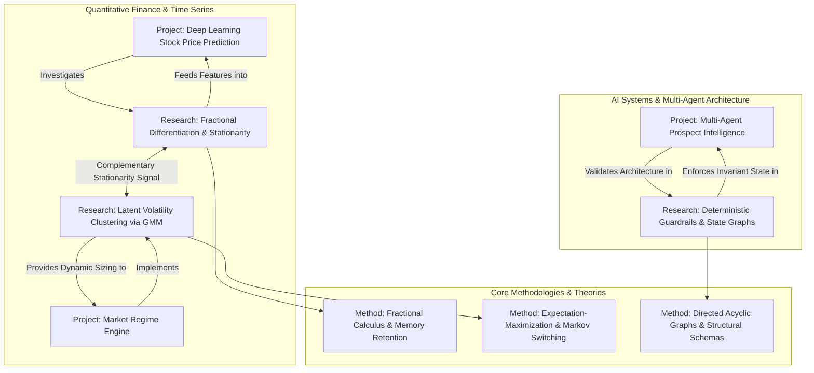

# Knowledge Graph & Content Relationships

This document details the relational topology linking Projects, Research Inquiries, Technical Topics, and Methodologies across the website.

## 1. Relational Graph Structure

## 2. Bidirectional Mapping Matrix

| Source Entity | Type | Target Entity | Target Type | Relationship Context |
|---|---|---|---|---|
| `deep-learning-stock-return-prediction` | Project | `signal-research` | Research | Evaluates fractionally differenced series vs raw log returns for feature inputs. |
| `signal-research` | Research | `deep-learning-stock-return-prediction` | Project | Provides the mathematical feature transformation pipeline utilized in model training. |
| `market-regime-engine` | Project | `market-regimes` | Research | Implements unsupervised GMM regime classification to prevent strategy drawdown. |
| `market-regimes` | Research | `market-regime-engine` | Project | Yields the empirical transition probability matrix used by the production backtester. |
| `multi-agent-prospect-intelligence` | Project | `agentic-systems` | Research | Implements LangGraph state machine with deterministic schema validators. |
| `agentic-systems` | Research | `multi-agent-prospect-intelligence` | Project | Evaluates latency, hallucination suppression, and tool invocation determinism. |

## 3. UI Navigation Implementation

On each `/projects/[slug]` detail page:
- Renders a dedicated **"Related Research & Inquiries"** section linking directly to the corresponding `/research/[slug]` inquiry.

On each `/research/[slug]` detail page:
- Renders a **"Implemented in Production Systems"** project card linking back to the associated case study.
- Renders an **"Investigative Next Steps"** card with direct contextual actions (explore related research, view case study, or contact for technical discussion).
