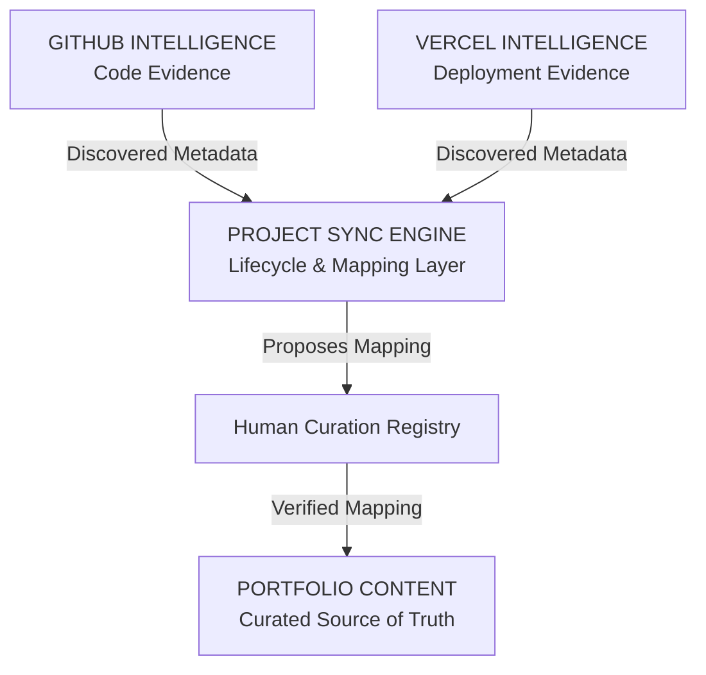

# Project Synchronization System Architecture

## 1. Executive Summary & Objective

The **Project Synchronization System** creates a safe, deterministic, and verifiable bridge connecting:
- **`PORTFOLIO`**: Human-curated source of truth (narrative, architecture, tradeoffs, and classification).
- **`GITHUB`**: Code and repository evidence (commits, languages, topics, and source availability).
- **`VERCEL`**: Deployment and production evidence (domains, targets, build states, and live URLs).

### Core Principle:
`GITHUB` tells us what code exists.
`VERCEL` tells us what is deployed.
`THE PORTFOLIO` tells the curated engineering story.
Project Sync connects these sources without taking control away from the curated portfolio.

---

## 2. Source-of-Truth Hierarchy

---

## 3. Key Components & Architecture

1. **Unified Identity Engine**: [`src/lib/projectSync/identity.ts`](file:///d:/web/protfolio/src/lib/projectSync/identity.ts)
2. **Multi-Level Matcher**: [`src/lib/projectSync/matcher.ts`](file:///d:/web/protfolio/src/lib/projectSync/matcher.ts)
3. **Conflict Detection Engine**: [`src/lib/projectSync/conflict.ts`](file:///d:/web/protfolio/src/lib/projectSync/conflict.ts)
4. **Change Detection Engine**: [`src/lib/projectSync/changeDetector.ts`](file:///d:/web/protfolio/src/lib/projectSync/changeDetector.ts)
5. **Sync Engine & Reports**: [`src/lib/projectSync/syncEngine.ts`](file:///d:/web/protfolio/src/lib/projectSync/syncEngine.ts)
6. **Curation Registry**: [`src/data/projectSync/curation.ts`](file:///d:/web/protfolio/src/data/projectSync/curation.ts)
