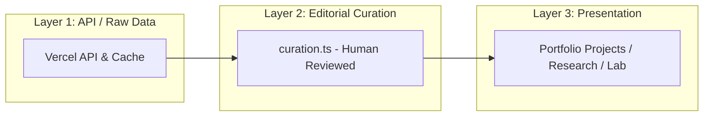

# Vercel Curation System

## 1. Overview & Separation of Concerns

The Curation Registry [`src/data/vercel/curation.ts`](file:///d:/web/protfolio/src/data/vercel/curation.ts) represents the human-verified truth linking Vercel hosting projects with portfolio engineering artifacts.



---

## 2. Curation Schema

Every entry adheres to `VercelCurationEntry`:

```typescript
{
  vercelProjectId: string;          // Vercel project ID
  vercelProjectName: string;        // Vercel project name
  portfolioProjectId?: string;      // Target portfolio slug
  researchId?: string;              // Target research inquiry
  labId?: string;                   // Target lab experiment
  preferredDeploymentUrl?: string;  // Preferred canonical URL
  target: 'production' | 'preview'; // Deployment target
  displayLabel?: string;            // UI display title
  publish: boolean;                 // Editorial visibility flag
  gitRepository?: string;           // Associated repository
  verifiedAt: string;               // Verification ISO timestamp
  notes?: string;                   // Contextual rationale
}
```

---

## 3. Human Control Guarantees

1. **No Automatic Publishing**: An unmatched Vercel project remains in the inventory as `VERCEL_ONLY` until explicitly added to the curation registry.
2. **Editorial Overrides**: The curation registry can specify a preferred custom domain, override target classification, or disable publishing (`publish: false`).
3. **Immutability**: Synchronization runs will never delete or rewrite curation entries.
