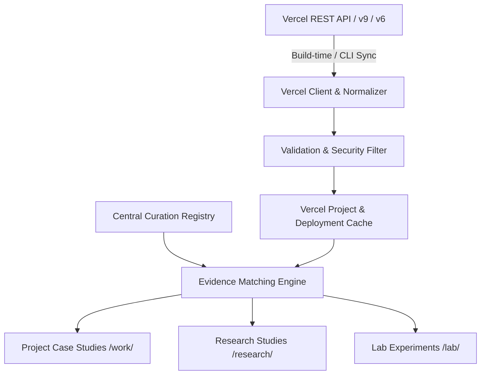

# Vercel Intelligence Architecture

## 1. Executive Summary & Purpose

The **Vercel Intelligence Layer** provides verified deployment and hosting evidence for projects, research studies, and lab experiments in the Personal Engineering & Research Platform of Uzair Ahmad.

### Fundamental Separation of Concerns:
- **`VERCEL`**: Deployment & Hosting Evidence (*"Where is it deployed? What is its production state? What framework is verified?"*)
- **`GITHUB`**: Source Code & Implementation Evidence (*"Where is the source code? What commits and languages exist?"*)
- **`PORTFOLIO`**: Curated Engineering Presentation (*"Why was it engineered? What trade-offs were made? What problem was solved?"*)

---

## 2. Core Philosophy & Anti-Patterns

### What Vercel Intelligence IS:
- A factual verification layer linking portfolio entities to live production deployments and preview demonstrators.
- A provenance-tracking system recording timestamps (`lastVerifiedAt`), environments, and frameworks.
- A build-time, cache-first architecture immune to API rate limits and network outages.

### What Vercel Intelligence is NOT (Anti-Patterns Avoided):
- **NOT an Auto-Publisher**: It NEVER creates portfolio pages or modifies project narratives automatically.
- **NOT a Quality Scorer**: Deployment existence does not imply algorithmic rigor, code quality, or business impact.
- **NOT a Fake Analytics Dashboard**: Zero fabricated uptime metrics, traffic numbers, or latency charts.
- **NOT Live Infrastructure Monitoring**: No continuous browser polling, alerting, or APM overhead.

---

## 3. Architecture Overview

---

## 4. Key Artifacts & Modules

1. **Configuration**: [`src/config/vercel.ts`](file:///d:/web/protfolio/src/config/vercel.ts)
2. **Data Models**: [`src/types/vercel.ts`](file:///d:/web/protfolio/src/types/vercel.ts)
3. **Curation Layer**: [`src/data/vercel/curation.ts`](file:///d:/web/protfolio/src/data/vercel/curation.ts)
4. **Baseline Cache**: [`src/data/vercel/projects.ts`](file:///d:/web/protfolio/src/data/vercel/projects.ts)
5. **Engine Modules**:
   - [`src/lib/vercel/normalizer.ts`](file:///d:/web/protfolio/src/lib/vercel/normalizer.ts)
   - [`src/lib/vercel/validator.ts`](file:///d:/web/protfolio/src/lib/vercel/validator.ts)
   - [`src/lib/vercel/client.ts`](file:///d:/web/protfolio/src/lib/vercel/client.ts)
   - [`src/lib/vercel/matcher.ts`](file:///d:/web/protfolio/src/lib/vercel/matcher.ts)
   - [`src/lib/vercel/evidence.ts`](file:///d:/web/protfolio/src/lib/vercel/evidence.ts)
   - [`src/lib/vercel/sync.ts`](file:///d:/web/protfolio/src/lib/vercel/sync.ts)
6. **UI Presentation**: [`src/components/vercel/VercelEvidenceBadge.astro`](file:///d:/web/protfolio/src/components/vercel/VercelEvidenceBadge.astro)
